<div style="display: flex; flex-direction: column; align-items: center;">
  
</div>

<div style="display: flex; flex-direction: column; align-items: center; padding-bottom: 50px">
  
</div>

# Orbea Monegros Python PAC4 Package

Welcome to the **Orbea Monegros PAC4** Python package, developed to analyze and manage data from the famous mountain biking event **Orbea Monegros 2024**. This package includes tools to handle anonymized rider data, perform statistical analysis, and generate visualizations of the results.

## Table of Contents

1. [Introduction](#introduction)
2. [Features](#features-of-orbea-monegros-pac4)
3. [Prerequisites](#prerequisites)
4. [Installation](#installation)
5. [Project Folders](#comprehensive-overview-of-project-folders-and-files)
6. [Usage](#usage)
7. [Documentation Generation](#documentation-generation)
8. [Security Analysis](#security-analysis)
9. [GitHub Actions CI/CD Workflow](#github-actions-cicd-workflow)
10. [Contributing](#contributing)
11. [License](#license)

---

## Introduction

The **Orbea Monegros** is one of the most popular mountain biking events held in Sariñena (Huesca). This package allows you to manage and analyze anonymized rider data, providing useful tools for researchers, organizers, and cycling enthusiasts. This package contains the solution to PAC4 related to **Orbea Monegros**.

---

## Features of Orbea Monegros PAC4

- **Statistical Calculations:**
  - Average times.
  - Time distribution by category.
- **Visualizations:**
  - Histograms and comparative charts.
- **Data Manager:**
  - Read and process anonymized datasets.
- **CLI Tools:**
  - Run analysis and other tasks directly from the command line.
- **HTML Reports & Documentacion**
  - HTML Coverage Tests, HTML Vulnerabilities report, HTML modules and functions documentation

---

## Prerequisites

- **Python 3.10 or later**.
- Dependencies listed in `requirements.txt`.

---

## Installation

1. Clone the repository:

   ```bash
   git clone https://github.com/jbalcellssUOC/GCD-PCD_Pac4.git
   cd GCD-PCD_Pac4
   ```

2. Create a virtual environment:

   ```bash
   python -m venv venv
   source venv/bin/activate   # macOS/Linux
   .\venv\Scripts\activate  # Windows
   ```

3. Install dependencies:

   ```bash
   pip install -r requirements.txt
   ```

4. Install the package in editable mode:

   ```bash
   pip install -e .
   ```

### `setup.py`

The `setup.py` file is a key component in Python packages. It serves as the build script for the `setuptools` tool, which is used to package and distribute Python projects. This file provides metadata and instructions that allow Python's packaging tools to properly install and manage the package.

#### Key Features of `setup.py`

1. **Defines Metadata**: Specifies the package name, version, author, license, and a short description of the project.Also includes additional metadata like dependencies, classifiers, and project URLs.

2. **Handles Dependencies**: Lists the required packages for the project using the `install_requires` argument and ensures that dependencies are automatically installed when the package is installed.

3. **Supports Packaging and Distribution**: Allows the creation of source distributions (`sdist`) and wheel distributions (`bdist_wheel`) using commands like `python setup.py sdist` or `python setup.py bdist_wheel`. Also enables uploading the package to the Python Package Index (PyPI) for public or private distribution.

4. **Custom Installation Commands**: Provides hooks to include custom behaviors during the installation process.

---

## Comprehensive Overview of Project Folders and Files

📂 root

- 📜 main.py
- 📜 run_tests.py
- 📜 setup.py
- 📄 requirements.txt
- 📖 README.md
- 📝 LICENSE.md
- 📖 INSTALL.md
- 📖 CONTRIBUTING.md
- 📖 CHANGELOG.md

├── 📂 **orbea_monegros** -> Contains modules source for all PAC4 exercises in the project.

├── 📂 **data** -> Contains the application's dataset files, essential for analysis and processing.

├── 📂 **tests** -> Contains the complete test suite for validating application functionality.

├── 📂 **coverage** -> Contains detailed coverage reports in HTML and XML formats, as well as HTML test documentation.

├── 📂 **docs** -> Contains HTML documentation for all module functions and their usage.

├── 📂 **img** -> Contains saved images in PNG format of histograms and scatter plots.

├── 📂 **images** -> Contains images optimized for usage in Markdown files.

├── 📂 **.github\workflows** -> Contains CD-CI GitHub Actions files, *python-app.yml*.

## Usage

### How to run the code from the command line

To execute all the analysis exercises included in this PAC4, you can run the following command. This will ensure that the specified dataset is processed according to the requirements and logic defined in the main script, providing the necessary outputs for the complete analysis.

```bash
python main.py -d data/dataset.csv
```

If you wish to execute only one of the exercises (from 1 to 5), you must use the following command with the "e" option followed by the exercise number. Keep in mind that each individual exercise may depend on the execution of previous exercises, and therefore, the output will include information related to those as well.

```bash
python main.py -d data/dataset.csv -e 1
```

### Additional Parameters and Guidance

Use the -h parameter to access detailed help on the application's functionality and available startup options. This feature provides valuable insights into the script's operations and allows you to explore various arguments and modifiers to tailor its behavior to your needs.

>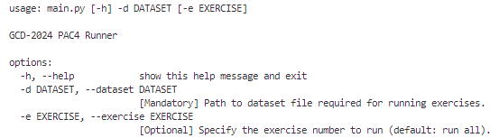

## Tests Suite

### How to Run Tests

To execute the test suite and validate the functionality of the code, you can use the following command. This command will run the tests while limiting failures to five, suppressing warnings, and generating both XML and HTML coverage reports:

```bash
pytest --maxfail=5 --disable-warnings --cov=orbea_monegros --cov-report=xml:coverage/coverage.xml --cov-report=html:coverage
```

This will generate the HTML coverage report in the specified './coverage' directory, allowing you to analyze the test coverage in detail.

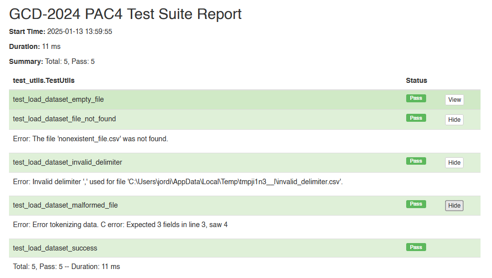

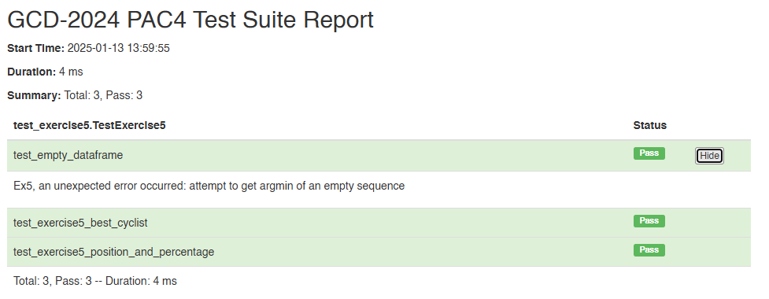

## Running Tests in Visual Studio Code and Command Line

You can execute the test suite for this project either through the command line or directly within the Visual Studio Code or your favorite IDE. Both approaches provide detailed feedback on the status of each test, making it easy to identify and resolve any issues.

When running tests via the command line using `unittest`, you will see a summary of the tests executed, including the total number of tests, their status (passed, failed, or errored), and the time taken to complete. This output is straightforward and efficient for developers who prefer a terminal-based workflow.

Alternatively, Visual Studio Code and others IDE's offers an integrated testing experience with its Testing sidebar. It provides an intuitive interface to run and debug tests individually or as a suite. Results are displayed in real-time, with clear visual indicators for success or failure, making it ideal for developers who prefer a more graphical approach to testing. This combination of methods ensures flexibility and convenience in maintaining test quality across the project. 

> **Note**: Some exceptions are intentionally handled during negative test cases in certain exercises, as demonstrated in the test suite. These tests ensure that the code behaves as expected when encountering invalid inputs or edge cases, reinforcing its robustness.

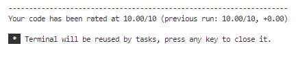
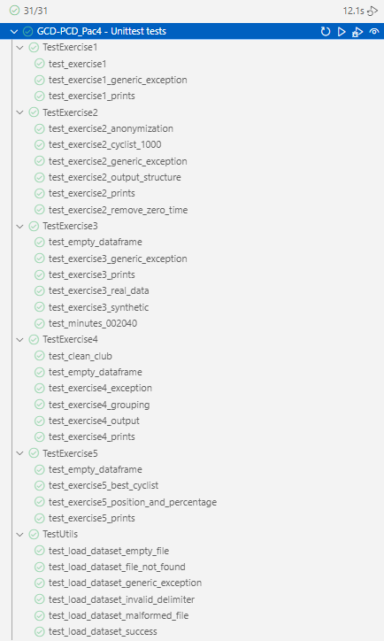

### How to Review Coverage HTML Reports

To review the coverage reports using an alternative approach, you can first run the tests with the coverage tool and then generate the HTML report. Use the following commands:

```bash
coverage run --source=orbea_monegros -m unittest discover -s tests -p 'test_*.py'
coverage html -d coverage
```

> **Note**: This will generate the HTML coverage report in the specified './coverage' directory, allowing you to analyze the test coverage in detail.

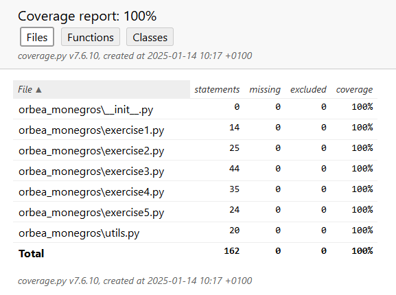

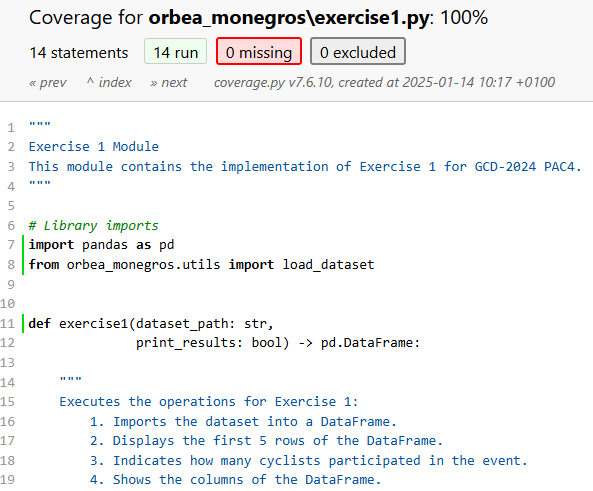

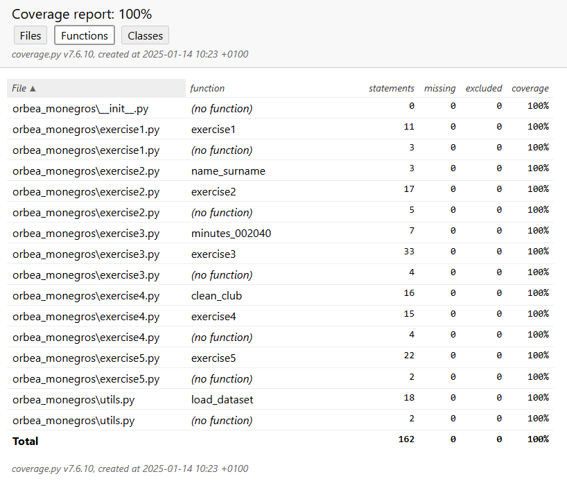

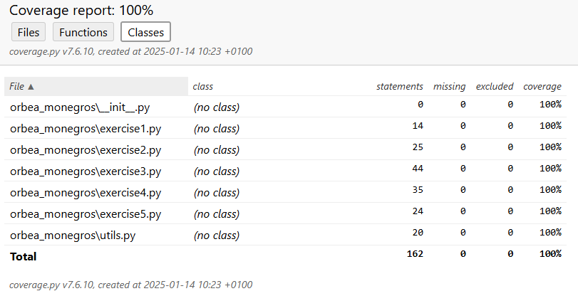

---

## Documentation Generation

### How to Generate Documentation

To generate comprehensive documentation for codebase, including modules and tests, you can use the following command:

```bash
pdoc --output-dir docs orbea_monegros tests main.py run_tests.py
```

This command uses pdoc to create HTML documentation for the specified modules and scripts (orbea_monegros, tests, main.py, and run_tests.py). The output is saved in the '.docs' directory, providing an easy-to-navigate overview of the code's structure, functions, and classes. This documentation can be opened in a web browser to review the details of the codebase effectively.

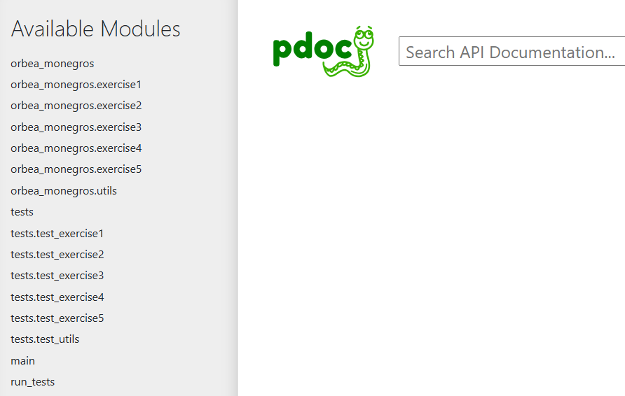

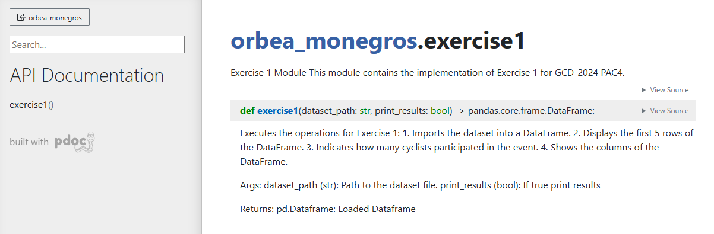

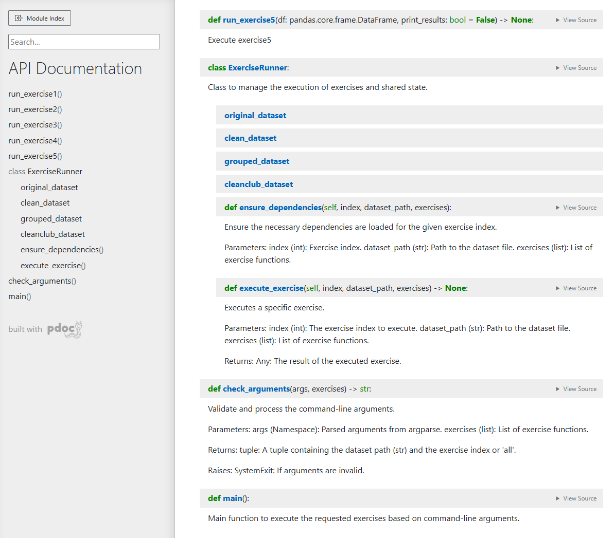

### Security Analysis

#### How to Perform a Security Analysis

To perform a security analysis of your codebase, you can use the following command:

```bash
bandit -r orbea_monegros tests main.py run_tests.py setup.py -f html -o coverage/bandit_report.html
```

> **Note**: This command runs bandit, a tool designed to identify common security issues in Python code. It recursively scans the specified files and directories (orbea_monegros, tests, main.py, run_tests.py, and setup.py) for potential vulnerabilities.

The analysis results are formatted as an HTML report and saved to './coverage/bandit_report.html'. You can open this file in a web browser to review any identified security risks and address them effectively.

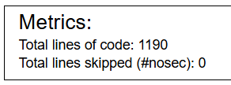

### Code Quality Analysis

#### How to Perform Static Code Analysis

To perform a static code analysis and ensure adherence to Python coding standards, you can use the following command:

```bash
pylint orbea_monegros/ tests/ main.py run_tests.py
```

This command runs pylint, a static code analysis tool, on the specified directories and files (orbea_monegros/, tests/, main.py, and run_tests.py). It evaluates the code for:

- Code quality and compliance with Python standards (PEP 8).
- Potential errors and anti-patterns.
- Suggestions for code improvements and refactoring.

> **Note**: The output includes a detailed report with a score and recommendations for enhancing code quality, making it a useful tool for maintaining clean and maintainable code.


### GitHub Actions CI/CD Workflow

#### Summary of Configuration

A GitHub Actions workflow has been configured using the `python-app.yml` file to automate testing, linting, and deployment processes for the project. The workflow ensures code quality and functionality by executing the following tasks:

1. **Setup and Dependencies**:
   - The workflow runs on a specified matrix of Python versions.
   - It sets up the required Python environment and installs dependencies using `pip`.

2. **Linting**:
   - Ensures adherence to coding standards by running tools like `flake8` or similar linters.

3. **Testing**:
   - Executes the test suite using `pytest` or an equivalent testing framework to validate the codebase.
   - Generates test coverage reports for further analysis.

4. **Security Scanning**:
   - Integrates tools like `bandit` to perform static analysis and identify potential security vulnerabilities in the code.

5. **Artifact Management**:
   - Uploads test results, coverage reports, and other relevant artifacts to the workflow for detailed inspection.

6. **Deployment (Optional)**:
   - Automates deployment processes if conditions (like passing all tests) are met.

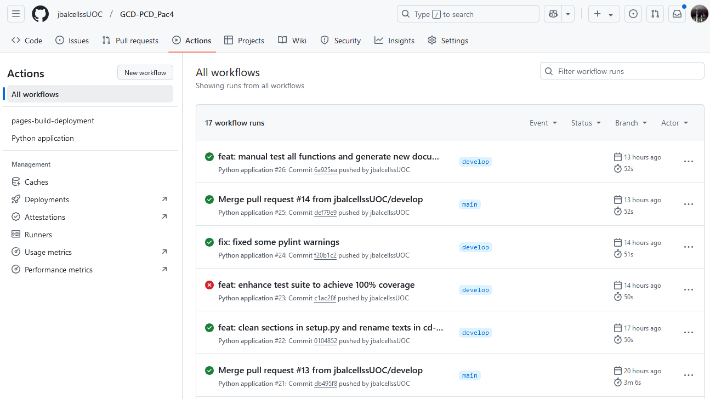

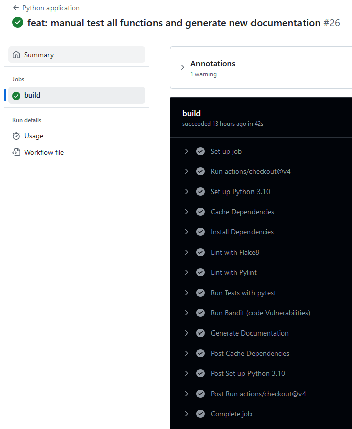

#### Purpose

The workflow provides a robust CI/CD pipeline, ensuring consistent code quality and reducing manual intervention in repetitive tasks. It supports a seamless development process, from code validation to deployment.

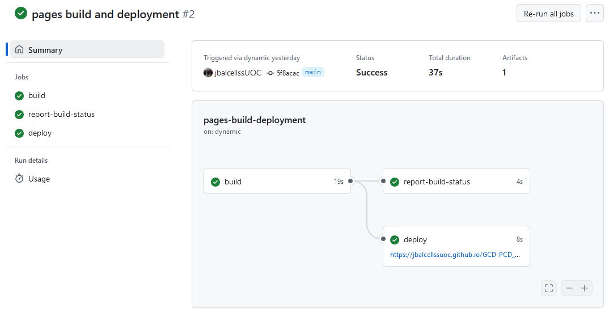

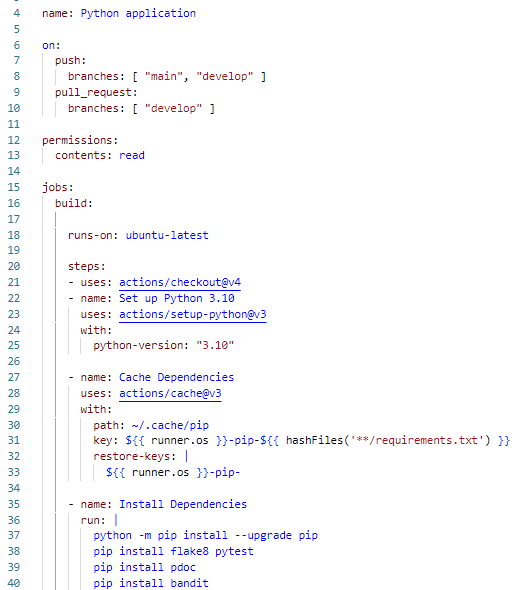

## Contributing

Contributions are welcome. Please read the [CONTRIBUTING.md](CONTRIBUTING.md) file for more information.

Basic steps to contribute:

1. Create a branch for your feature:

   ```bash
   git checkout -b feature/new-feature
   ```

2. Ensure tests pass:

   ```bash
   pytest tests/
   ```

3. Submit a Pull Request explaining your changes.

---

## License

This project is under the MIT license. See the [LICENSE](LICENSE) file for more details.

---

Thank you for using the **Orbea Monegros PAC4** package! If you have questions or suggestions, feel free to contact the author:

- **Author:** Jordi Balcells Saenz
- **Email:** [jbalcellss@uoc.edu](mailto:jbalcellss@uoc.edu)
- **Repository:** [https://github.com/jbalcellssUOC/GCD-PCD_Pac4](https://github.com/jbalcellssUOC/GCD-PCD_Pac4)
